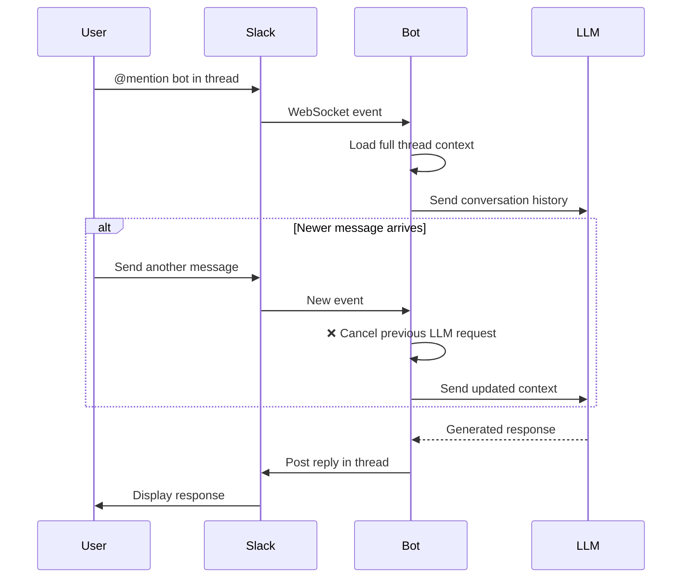
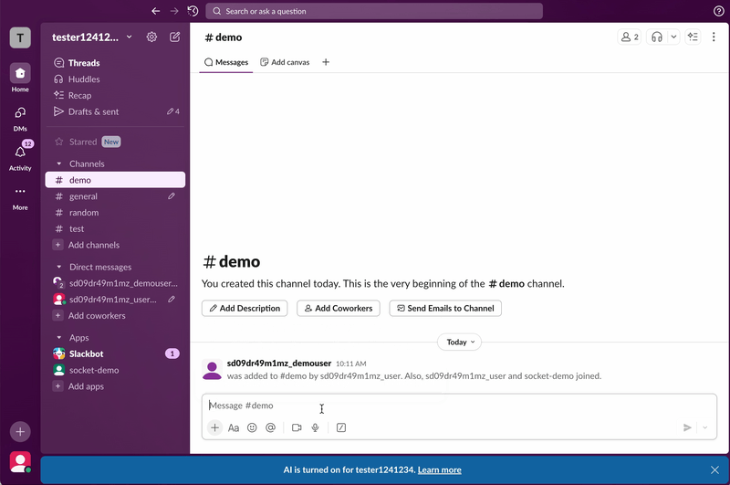

# Fishy ZIO HTTP Slack Bot

> **Connect Slack to OpenAI-compatible LLMs**

A Slack bot that creates natural chat experiences with AI, handling stateless LLMs, high concurrency, and complete conversation context.

## The Problem

Most LLM providers don't offer session management. When integrating with Slack:
- **Lost context**: LLMs forget previous messages
- **Slow responses**: Sequential processing can't handle multiple threads
- **Race conditions**: Concurrent messages cause chaos
- **No observability**: Can't debug or monitor AI interactions

## The Solution

**Fishy** solves these with:

 **Persistent conversation threads** - Reconstructs full context for stateless LLMs  
 **Parallel thread processing** - Handle hundreds of conversations simultaneously  
 **Latest-wins pattern** - Automatically cancels outdated requests  
 **Full observability** - OpenTelemetry tracing + metrics out of the box  
 **OpenAI-compatible** - Ollama (local), OpenAI, Azure, Together, Fireworks (plug & play)

### How It Works





*Natural (?) conversation with full context retention and concurrent message handling*

**Key Features:**
- **Thread-centric**: Each Slack thread = one conversation with full context
- **Resilient**: WebSocket reconnection, health monitoring, graceful shutdown
- **Scalable**: Per-thread worker fibers, event-driven architecture
- **Observable**: Distributed tracing, metrics, structured logging

## Quick Start (Docker)

### Prerequisites
- Docker or Podman
- LLM provider with OpenAI-compatible API (Ollama local or API key for cloud providers)

### 1. Create Slack App

Create and configure a Slack app with Socket Mode to get your tokens:

 **[Complete Slack App Setup Guide](./docs/SLACK_APP_SETUP.md)**

You'll need:
- `APP_SLACK_APP_TOKEN` (starts with `xapp-`) - For Socket Mode connection
- `APP_SLACK_BOT_TOKEN` (starts with `xoxb-`) - For posting messages

> **Quick tip**: Use the included [`slack-app-manifest.yaml`](./slack-app-manifest.yaml) to create your app with all required permissions pre-configured.

### 2. Run with Docker

```bash
# Using Ollama (local, no API key needed)
docker run -d \
  -e APP_SLACK_APP_TOKEN="xapp-1-..." \
  -e APP_SLACK_BOT_TOKEN="xoxb-..." \
  -e APP_LLM_BASE_URL="http://host.docker.internal:11434" \
  -e APP_LLM_MODEL="llama3.2:3b" \
  quay.io/nestor9001/fishy-zio-http-slackbot:latest

# Using OpenAI
docker run -d \
  -e APP_SLACK_APP_TOKEN="xapp-1-..." \
  -e APP_SLACK_BOT_TOKEN="xoxb-..." \
  -e APP_LLM_BASE_URL="https://api.openai.com/v1" \
  -e APP_LLM_MODEL="gpt-4" \
  -e APP_LLM_API_KEY="sk-..." \
  quay.io/nestor9001/fishy-zio-http-slackbot:latest
```

### 3. Test in Slack

1. Invite the bot to a channel: `/invite @your-bot`
2. Start a thread and @mention the bot
3. The bot responds with full conversation context!

**That's it!** 🎉

---

## Configuration

### Environment Variables

| Variable | Required | Description | Default |
|----------|----------|-------------|---------|
| `APP_SLACK_APP_TOKEN` | ✅ | Slack app token (starts with `xapp-`) | - |
| `APP_SLACK_BOT_TOKEN` | ✅ | Slack bot token (starts with `xoxb-`) | - |
| `APP_LLM_BASE_URL` | ✅ | LLM API endpoint | - |
| `APP_LLM_MODEL` | ✅ | Model name | - |
| `APP_LLM_API_KEY` | ⚠️ | API key (not needed for Ollama) | - |
| `APP_LLM_TEMPERATURE` | ❌ | Response randomness (0.0-2.0) | `0.7` |
| `APP_LLM_MAX_TOKENS` | ❌ | Max response length | - |
| `APP_LLM_SYSTEM_PROMPT` | ❌ | System instruction for LLM | `"You are a helpful assistant in a Slack workspace."` |
| `APP_PING_INTERVAL_SECONDS` | ❌ | WebSocket ping interval | `5` |
| `APP_SOCKET_COUNT` | ❌ | WebSocket connections | `3` |
| `APP_DEBUG_RECONNECTS` | ❌ | Fast reconnects for testing | `false` |
| `APP_LOG_LEVEL` | ❌ | Logging level | `INFO` |
| `APP_OTEL_SERVICE_NAME` | ❌ | OpenTelemetry service name | - |
| `APP_OTEL_INSTRUMENTATION_SCOPE_NAME` | ❌ | OTel instrumentation scope | - |
| `APP_OTEL_OTLP_ENDPOINT` | ❌ | OpenTelemetry collector endpoint | - |

### LLM Providers

**Any OpenAI-compatible API** (uses `/v1/chat/completions` endpoint):

**Ollama (Local)**:
```bash
APP_LLM_BASE_URL="http://localhost:11434"
APP_LLM_MODEL="llama3.2:3b"
# No API key needed
```

**OpenAI**:
```bash
APP_LLM_BASE_URL="https://api.openai.com/v1"
APP_LLM_MODEL="gpt-4"
APP_LLM_API_KEY="sk-..."
```


**Groq** (quick setup*):
```bash
APP_LLM_BASE_URL="https://api.groq.com/openai"
APP_LLM_MODEL="llama-3.3-70b-versatile"
APP_LLM_API_KEY="gsk_..."
```

> **Note**: Only providers with OpenAI-compatible APIs are supported. Anthropic, Google Gemini, and Cohere use different formats and won't work.

See [docs/LLM_PROVIDERS.md](./docs/LLM_PROVIDERS.md) for more options.

---

## Local Development & Testing

### Full Stack with Observability

Use the included Kubernetes pod for local testing:

```bash
# Start everything (bot + Ollama + observability)
podman kube play ./scripts/slackbot-pod.yaml
-> Don't forget to update your tokens!
# Access dashboards
# Jaeger (traces):     http://localhost:16686
# Prometheus (metrics): http://localhost:9090
# Grafana (dashboards): http://localhost:3000
```

See [SLACKBOT_POD_README.md](./SLACKBOT_POD_README.md) for details.

### Development

```bash
# Clone and run
git clone https://github.com/Nestor10/fishy-zio-http-slackbot.git
cd fishy-zio-http-slackbot

# Create .env file with your configuration
cat > .env << EOF
APP_SLACK_APP_TOKEN="xapp-1-..."
APP_SLACK_BOT_TOKEN="xoxb-..."
APP_LLM_BASE_URL="http://localhost:11434"
APP_LLM_MODEL="llama3.2:3b"
EOF

# Load environment variables
source .env

# Run with hot reload
sbt dev  # Auto-restarts on code changes

# Or standard run
sbt run
```

## Observability

**Built-in OpenTelemetry integration:**

- 📊 **Distributed Tracing**: See message flow from Slack → LLM → Response
- 📈 **Metrics**: Thread count, LLM latency, WebSocket health
- 📝 **Structured Logging**: Correlation IDs, context propagation

**Pre-configured dashboards** for Jaeger, Prometheus, and Grafana included.

See [docs/ZIO_TELEMETRY_GUIDE.md](./docs/ZIO_TELEMETRY_GUIDE.md) for setup.

---

## Documentation

- **[ARCHITECTURE.md](./docs/ARCHITECTURE.md)** - System design and patterns
- **[RELEASE.md](./docs/RELEASE.md)** - Release process and deployment
- **[ZIO_TELEMETRY_GUIDE.md](./docs/ZIO_TELEMETRY_GUIDE.md)** - Observability setup
- **[LLM_PROVIDERS.md](./docs/LLM_PROVIDERS.md)** - LLM configuration guide
- **[SLACKBOT_POD_README.md](./SLACKBOT_POD_README.md)** - Local testing stack


## Contributing

PRs welcome! This project follows:
- Scala 3.7.2
- Functional programming patterns (Zionomicon)
- Scalafmt + Scalafix for code quality

---

## License

[MIT](./LICENSE)

---

**Built with**  [ZIO](https://zio.dev) •  [zio-http](https://github.com/zio/zio-http) •  [OpenTelemetry](https://opentelemetry.io)


### 3. Run Bot
```bash
sbt run (sbt ~reStart)
```

### 4. View Telemetry
- **Traces**: http://localhost:16686 (Jaeger)
- **Metrics**: http://localhost:9090 (Prometheus)
- **Dashboards**: http://localhost:3000 (Grafana - admin/admin)

### 5. Test
Send `@bot` message in Slack, then rapidly send more messages to trigger LLM interruption!

## Design Philosophy

- **Selective Engagement** - Bot only acts on intentional @mentions, never thread noise
- **Speculative Execution** - Start LLM immediately, interrupt if superseded (token efficiency!)
- **Production Observability** - OpenTelemetry Collector pattern for vendor-neutral telemetry
- **Domain Purity** - Clean separation between Slack protocol and business logic  
- **ZIO Native** - Leverages ZIO's effect system for composable, testable services
- **Type Safety** - Compile-time guarantees for Slack event handling
- **Crash Resilient** - Stateless recovery using Slack as source of truth

Built for production-ready Slack bots that need reliable, maintainable conversation management.

## Development

### Commands
- `sbt compile` - Compile the code
- `sbt dev` - Run with hot-reload (recommended)
- `sbt run` - Run the application
- `sbt console` - Start a Scala 3 REPL

### Observability
- `./scripts/start-observability.sh` - Start OTel Collector stack (Podman)
- `./scripts/start-jaeger.sh` - Quick Jaeger-only setup (Podman)
- `podman-compose logs -f` - View all service logs

### Documentation
- [Architecture](docs/ARCHITECTURE.md) - **Complete system architecture** ⭐
- [ZIO Telemetry Guide](docs/ZIO_TELEMETRY_GUIDE.md) - **Concise telemetry implementation guide** ⭐
- [OpenTelemetry Setup](docs/OPENTELEMETRY_SETUP.md) - Quick observability reference
- [OTel Collector Stack](docs/OTEL_COLLECTOR_STACK.md) - Full observability setup
- [LLM Providers](docs/LLM_PROVIDERS.md) - Multi-provider LLM configuration
- [Testing Guide](TESTING_GUIDE.md) - Testing strategies

## Architecture

For a comprehensive overview of the system architecture, design patterns, and implementation details, see **[docs/ARCHITECTURE.md](docs/ARCHITECTURE.md)**.

Key highlights:
- **Event-Driven Architecture** with domain events and pluggable processors
- **Per-Thread Workers** with latest-wins pattern for optimal UX
- **Multi-Provider LLM Support** (Ollama, OpenAI, Anthropic, Azure)
- **Full Observability** with OpenTelemetry tracing and ZIO metrics
- **Zionomicon Patterns** throughout (service pattern, Hub broadcasting, scoped resources)

## License

MIT License - see [LICENSE](LICENSE) file for details.
