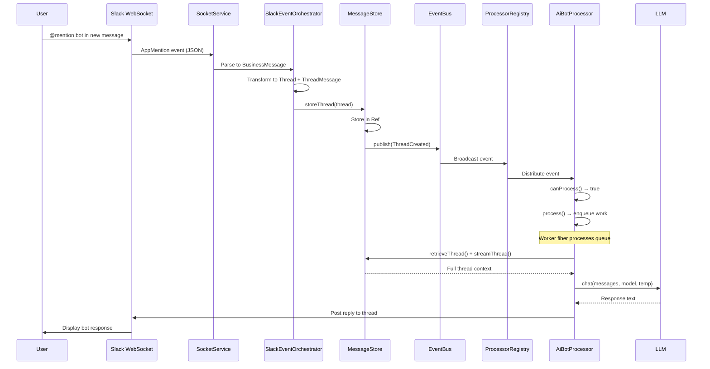
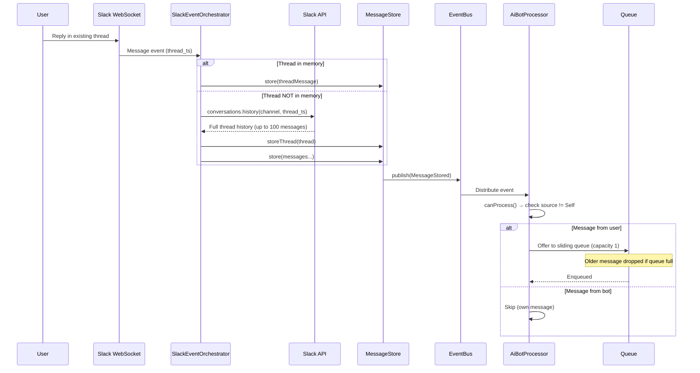
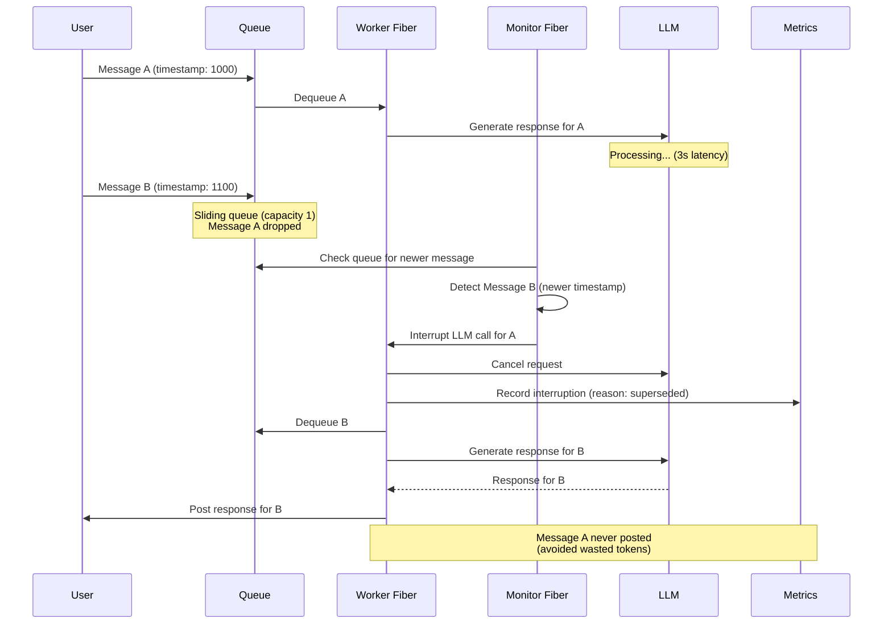
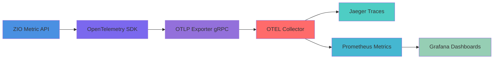

# fishy-zio-http-slackbot Architecture

**Last Updated**: October 7, 2025  
**Status**: MVP Complete - Production Ready  
**Architecture**: Event-Driven AI Bot with Multi-Provider LLM Support

---

## Table of Contents

1. [Overview](#overview)
2. [Architecture Principles](#architecture-principles)
3. [System Architecture](#system-architecture)
4. [Core Components](#core-components)
5. [Data Flow](#data-flow)
6. [Key Design Patterns](#key-design-patterns)
7. [Observability](#observability)
8. [Configuration](#configuration)
9. [Deployment](#deployment)

---

## Overview

fishy-zio-http-slackbot is a **Slack bot** built with **ZIO 2.x** and **zio-http 3.x**, implementing Slack Socket Mode without Bolt framework. It features:

- **Event-Driven Architecture** with domain events and pluggable processors
- **AI-Powered Responses** with multi-provider LLM support (Ollama, OpenAI, Anthropic, Azure)
- **Per-Thread Processing** with latest-wins pattern for optimal user experience
- **Full Observability** with OpenTelemetry tracing and ZIO metrics
- **Resilient WebSocket** management with automatic reconnection
- **Functional Design** following Zionomicon patterns throughout

### Key Capabilities

- ✅ Real-time Slack event processing via WebSocket
- ✅ Multi-provider LLM integration with configurable authentication
- ✅ Thread-aware conversation management with context
- ✅ Distributed tracing with Jaeger/OTLP
- ✅ Prometheus metrics for all components
- ✅ Automatic thread recovery from Slack API
- ✅ Graceful shutdown with resource cleanup

---

## Architecture Principles

This project follows **Zionomicon** functional design principles:

### 1. Service Pattern (Chapters 17-18)
Every service follows: **trait + companion + Live implementation + ZLayer**

```scala
trait MyService {
  def doSomething: IO[Error, Result]
}

object MyService {
  case class Live(dependency: SomeDependency) extends MyService {
    override def doSomething: IO[Error, Result] = ???
  }
  
  val layer: ZLayer[SomeDependency, Nothing, MyService] = 
    ZLayer.fromFunction(Live.apply)
}
```

### 2. Domain Events Pattern (Appendix 3)
Events originate where facts happen:
- **MessageStore** publishes events on successful storage (atomic)
- **MessageEventBus** broadcasts events (dumb hub, Chapter 12)
- **Processors** filter events via `canProcess()` (smart subscribers)

### 3. Error Isolation
- Processor failures don't affect other processors or event bus
- Each processor runs in isolated fiber (`forkDaemon` + `catchAll`)
- Worker fibers auto-restart on failure

### 4. Resource Management (Chapter 15)
- All resources managed via `ZIO.scoped`
- WebSocket connections, Hub subscriptions, worker fibers
- Automatic cleanup on shutdown/interruption

### 5. Composable Effects
- Pure functional throughout
- No exceptions (all errors in ZIO type)
- Testable via ZLayer composition

---

## System Architecture

### High-Level Component Diagram

```
┌─────────────────────────────────────────────────────────────────────────┐
│                              Main Application                            │
│  - Config loading (HOCON + env vars)                                    │
│  - Layer composition & dependency injection                             │
│  - Graceful shutdown orchestration                                      │
└────────────────────────┬────────────────────────────────────────────────┘
                         │
         ┌───────────────┼───────────────┐
         ▼               ▼               ▼
┌─────────────┐  ┌──────────────┐  ┌─────────────────────┐
│ Socket      │  │ Message      │  │ AI Bot              │
│ Layer       │  │ Processing   │  │ Processing          │
│             │  │ Layer        │  │ Layer               │
└─────────────┘  └──────────────┘  └─────────────────────┘
```

### Layer-by-Layer Breakdown

#### Infrastructure Layer
- **SocketManager**: Multi-connection WebSocket pool with health monitoring
- **SocketService**: WebSocket lifecycle, message queues, event handling
- **SlackApiClient**: HTTP client for Slack API (socket URLs, posting messages)
- **LLMService**: Multi-provider LLM client (Ollama, OpenAI, Anthropic, Azure)
- **MessageEventBus**: Hub-based event broadcasting
- **MessageStore.InMemory**: In-memory persistence with domain events
- **OpenTelemetrySetup**: OTLP tracing configuration

#### Application Layer
- **MessageProcessorService**: Orchestrates Slack event processing (pure)
- **ProcessorRegistry**: Manages processors, distributes events via worker fiber
- **SlackEventOrchestrator**: Transforms Slack events to domain models

#### Domain Layer
- **MessageProcessor**: Interface for pluggable event processors
- **AiBotProcessor**: AI-powered bot with per-thread workers and latest-wins pattern
- **Thread / ThreadMessage**: Domain models for conversation management
- **SlackEvent**: Type-safe Slack event models

---

## Core Components

### 1. WebSocket Connection (Infrastructure)

**SocketService** handles WebSocket lifecycle:
- Connects to Slack's Socket Mode WebSocket URL
- Handles `hello`, `disconnect` messages
- Sends pings every configured interval
- Manages inbound/outbound queues

**SocketManager** provides connection pooling:
- Health monitoring with automatic reconnection
- Connection state tracking (Connecting, Connected, Closed)
- Error categorization and recovery strategies
- Metrics: connection uptime, reconnection count, state changes

**Key Pattern**: Request WebSocket URL via SlackApiClient, then connect via zio-http WebSocketApp

```scala
// Request URL
slackApiClient.requestSocketUrl 
  .flatMap { url =>
    // Connect with WebSocketApp
    socketService.connect(url)
  }
```

### 2. Message Processing Pipeline (Application)

**Data Flow**:
```
Slack WebSocket 
  → SocketService (JSON parsing)
    → InboundQueue 
      → MessageProcessorService (orchestration)
        → MessageStore (persistence + events)
          → MessageEventBus (broadcasting)
            → ProcessorRegistry Worker
              → [AiBot, Analytics, ...] (parallel)
```

**MessageProcessorService** (Pure Orchestration):
- Validates Slack events
- Transforms to domain models (Thread, ThreadMessage)
- Delegates to MessageStore
- **NO event publishing** (MessageStore handles that)
- **NO filtering** (Processors handle that)

**MessageStore** (Persistence + Events):
- Stores Thread and ThreadMessage objects
- Publishes events **on successful storage** (atomic):
  - `storeThread()` → `ThreadCreated` event
  - `store()` → `MessageStored` event
- Single source of truth for state changes
- Depends on MessageEventBus for publishing

**ProcessorRegistry** (Event Distribution):
- Worker fiber subscribes to MessageEventBus
- Distributes events to registered processors (parallel)
- Error isolation per processor (fork + catchAll)
- Auto-restart worker on fiber death

### 3. AI Bot Processor (Domain)

**AiBotProcessor** implements the AI response logic:

**Architecture**:
- **Per-Thread Workers**: Each conversation thread gets dedicated worker fiber
- **Sliding Queue (capacity 1)**: Latest message wins - earlier messages dropped
- **Speculative Execution**: Monitor loop cancels LLM if newer message arrives
- **Thread Recovery**: Fetches message history from Slack API if thread not in memory

**Key Methods**:
- `canProcess()`: Filters events (ignores bot's own messages, only handles MessageStored)
- `process()`: Enqueues work for thread (non-blocking)
- `getOrCreateWorker()`: Lazy worker creation per thread
- `consumeWorkForThread()`: Worker loop - debounce, generate response, post
- `monitorLoop()`: Checks for newer messages, interrupts LLM if superseded

**LLM Integration**:
- Multi-provider support: Ollama (local), OpenAI, Anthropic, Azure
- Configurable via `LLMConfig` (base URL, API key, model, system prompt)
- Dynamic layer selection based on config (local vs cloud)

**Metrics**:
- Active workers gauge
- LLM call duration histogram
- Interruption counter (superseded/monitor_error)
- Token usage (if available)

### 4. Domain Models

**Thread** (Conversation Context):
- `id`: ThreadId (Slack thread_ts)
- `channelId`: ChannelId (where conversation happens)
- `rootMessage`: ThreadMessage (first message in thread)
- `botIdentity`: BotIdentity (which bot owns this thread)

**ThreadMessage** (Individual Message):
- `id`: MessageId (Slack message_ts)
- `threadId`: ThreadId (parent thread)
- `author`: UserId (who sent it)
- `content`: String (message text)
- `source`: MessageSource (Self vs Other)
- `slackCreatedAt`: Instant (timestamp)

**Business Rules**:
- Only app mentions in new threads create Thread objects
- Mentions in existing threads are ignored (bot doesn't respond)
- Bot stores ALL messages (including its own) for complete history
- Thread recovery fetches up to 100 messages from Slack if not in memory

---

## Data Flow

### 1. New Thread Creation (App Mention)



### 2. Thread Reply Processing



### 3. Latest-Wins Pattern (Speculative Execution)



---

## Key Design Patterns

### 1. Latest-Wins Pattern (Per-Thread Queues)

Each thread gets a **sliding queue with capacity 1**:
- Only most recent message is processed
- Earlier messages automatically dropped
- Prevents stale responses
- Reduces wasted LLM calls

**Key Insight**: Users expect bot to respond to their LATEST message, not every message.

### 2. Structured Logging with LogContext

**FiberRef-based context propagation**:
- `LogContext.threadId()`, `LogContext.userId()`, `LogContext.operation()`
- Automatic fiber-local context in all logs
- Output: `[thread_id=C123.1234] [user_id=U123] Processing message`

**Available Contexts**: threadId, messageId, channelId, userId, operation, errorType, service-specific tags

### 3. Graceful Shutdown

**Resource Lifecycle**:
1. Main fiber interrupted (Ctrl+C)
2. Worker fibers canceled (children of main)
3. WebSocket connections closed with proper close frames
4. Hub subscriptions released
5. OpenTelemetry SDK shutdown (flush pending spans)

**Pattern**: All long-running processes use `ZIO.scoped` for automatic cleanup

### 4. Domain Event Sourcing

**Events Are Facts**:
- `ThreadCreated(threadId, channelId, timestamp)`
- `MessageStored(messageId, threadId, author, timestamp)`

**Event Flow**:
- **Origin**: MessageStore (where facts happen)
- **Transport**: MessageEventBus (dumb broadcaster)
- **Consumers**: Processors (smart subscribers with filtering)

**Benefits**:
- Single source of truth
- Impossible to desync (events published atomically with storage)
- Easy to add new processors (just register)
- Testable (mock event bus)

---

## Observability

**Complete OpenTelemetry-based observability** with unified export pipeline for traces, metrics, and logs.

### Architecture



**Flow**: ZIO Metric API → OpenTelemetry SDK (auto-bridge) → OTLP Exporter (gRPC) → OTEL Collector → Backends (Jaeger/Prometheus/Grafana)

### 1. Distributed Tracing

**Instrumented Operations**:
- `llm.generate_response` - LLM calls with context size, latency, interruption reason
- `slack.post_message` - Slack API calls with thread/channel IDs
- `message.store` - Storage operations
- `aibot.process` - Event processing

**Key Attributes**: `thread.id`, `channel.id`, `user.id`, `llm.model`, `llm.context_messages`, `llm.interrupted_reason`

**Trace Events**: `llm_request_start`, `llm_request_complete`, `llm_interrupted`, `slack_message_posted`

### 2. Metrics (OpenTelemetry/Prometheus)

**LLM Metrics**:
- `llm_requests_total` (Counter) - Calls by provider & model
- `llm_interruptions_total` (Counter) - Cancellations by reason
- `llm_latency_seconds` (Histogram) - Response time distribution
- `thread_workers_active` (Gauge) - Active speculative execution workers

**Socket Metrics**:
- `socket_connections_started_total` (Counter) - Connection attempts
- `socket_connections_closed_total` (Counter) - Closes by reason
- `socket_connection_duration_seconds` (Histogram) - Connection lifetime
- `socket_errors_total` (Counter) - Network errors by category
- `socket_connections_ok` (Gauge) - Healthy connections (updated every 10s)

**Storage Metrics**:
- `storage_threads_count` (Gauge) - Total conversation threads
- `storage_messages_count` (Gauge) - Total messages stored

**Implementation**: ZIO Metric API with `MetricLabel` for dimensions, automatic OpenTelemetry export via OTLP

### 3. Structured Logging

**Format**: JSON with timestamp, level, logger, message, fiber ID, FiberRef context fields

**Log Levels**:
- `DEBUG`: Internal state changes, queue operations
- `INFO`: Business events (message stored, LLM call, response posted)
- `WARN`: Recoverable errors (thread recovery, connection issues)
- `ERROR`: Unrecoverable errors (storage failure, critical bugs)

**Context Propagation**: FiberRef-based (thread_id, user_id, operation, etc.) - see Structured Logging pattern above

---

## Configuration

### Configuration Sources (Priority Order)
1. Environment variables (highest priority)
2. `application.conf` (HOCON)
3. Default values in code

### Key Configuration

**Slack Config** (`app.slack-app-token`):
- `APP_SLACK_APP_TOKEN`: App-level token (required)
- `APP_SLACK_BOT_TOKEN`: Bot token for posting (required)
- `APP_DEBUG_RECONNECTS`: Append `&debug_reconnects=true` to URL (fast reconnects)

**LLM Config** (`app.llm.*`):
- `APP_LLM_BASE_URL`: Provider base URL (default: http://localhost:11434 for Ollama)
- `APP_LLM_API_KEY`: API key (optional - Ollama doesn't need it)
- `APP_LLM_MODEL`: Model name (default: llama3.2)
- `APP_LLM_SYSTEM_PROMPT`: System message for context

**Socket Config** (`app.*`):
- `APP_PING_INTERVAL_SECONDS`: WebSocket ping interval (default: 5s)
- `APP_DEBUG_RECONNECTS`: Enable fast reconnects for dev (default: false)

**Observability Config**:
- `OTEL_EXPORTER_OTLP_ENDPOINT`: OTLP endpoint (default: http://localhost:4317)
- `OTEL_SERVICE_NAME`: Service name in traces (default: slack-bot)

### Provider Selection

**LLMService Layer Logic**:
```scala
config.llm.apiKey match {
  case Some(key) => // Cloud provider (OpenAI, Anthropic, Azure)
    Live(client, config.llm.baseUrl, Some(key))
  case None =>      // Local Ollama (no auth)
    Live(client, config.llm.baseUrl, None)
}
```

**Supported Providers**:
- **Ollama** (local): `baseUrl=http://localhost:11434`, no API key
- **OpenAI**: `baseUrl=https://api.openai.com/v1`, `apiKey=sk-...`
- **Anthropic**: `baseUrl=https://api.anthropic.com/v1`, `apiKey=sk-ant-...`
- **Azure OpenAI**: `baseUrl=https://<resource>.openai.azure.com`, `apiKey=<azure-key>`

---

## Deployment

### Local Development

**Prerequisites**:
- Scala 3.7.2
- sbt 1.11.5
- Java 23+
- Ollama (for local LLM) or cloud LLM API key
- Docker (for Jaeger/observability stack)

**Running the Bot**:
```bash
# Set environment variables
export APP_SLACK_APP_TOKEN="xapp-..."
export APP_SLACK_BOT_TOKEN="xoxb-..."
export APP_LLM_BASE_URL="http://localhost:11434"  # Ollama
export APP_LLM_MODEL="llama3.2"


# Run bot
sbt run

---

## Architecture Evolution

### Completed Phases (MVP)

**Phases 1-6**: Socket Architecture
- ✅ WebSocket connection management
- ✅ Message queuing and processing
- ✅ Error handling and reconnection
- ✅ Multi-connection pool

**Phase 7**: Event-Driven Refactor (Option 2)
- ✅ Domain events in MessageStore
- ✅ Hub-based broadcasting
- ✅ Pluggable processors

**Phase 8-9**: AI Bot
- ✅ Per-thread workers
- ✅ Latest-wins pattern
- ✅ Thread recovery from Slack

**Phase 10-11**: Production Polish
- ✅ Structured logging
- ✅ Configuration management
- ✅ Graceful shutdown

**Phase 12**: Observability
- ✅ OpenTelemetry tracing
- ✅ Prometheus metrics
- ✅ Jaeger integration

**Phase 13**: Metrics Standardization
- ✅ ZIO Metric API migration
- ✅ Two-layer metrics architecture
- ✅ Consistent metric naming

### Future Enhancements

**Phase 14**: Persistence Layer
- [ ] PostgreSQL storage (replace in-memory) or some service that would allow users to examin utilization. 
- [ ] Thread/message archival

**Phase 15**: Advanced Features
- [ ] Multi-bot support (different personalities)
- [ ] LLM4S integration (why would i build rag tools and other capibilities in here)

**Phase 16**: Scalability
- [ ] Load balancing (multiple instances)

---

## References

### Zionomicon Chapters
- **Appendix 3**: Functional Design (domain events, separation of concerns)
- **Chapter 12**: Hub - Broadcasting (event bus pattern)
- **Chapter 15**: Scope - Composable Resources (resource management)
- **Chapter 17-18**: Dependency Injection (service pattern, ZLayer)
- **Chapter 11**: Queue - Work Distribution (per-thread queues)

### Documentation
- [Slack Socket Mode](https://api.slack.com/apis/connections/socket)
- [ZIO Documentation](https://zio.dev)
- [zio-http Documentation](https://zio.github.io/zio-http/)
- [OpenTelemetry](https://opentelemetry.io)

### Project Docs
- `TESTING_GUIDE.md`: Testing strategies
- `README.md`: Quick start guide
- `docs/LLM_PROVIDERS.md`: LLM provider setup
- `docs/OPENTELEMETRY_SETUP.md`: Observability setup

---

**Last Updated**: October 7, 2025  
**Maintained By**: Nestor10  
**License**: See LICENSE file
